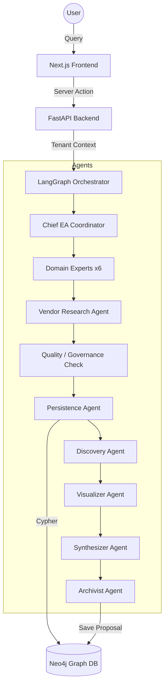

# hive.EnterpriseArchitectureOS

[](LICENSE)
[](https://www.python.org/downloads/)
[](https://nextjs.org/)

**hive.EnterpriseArchitectureOS** is a next-generation, multi-agent intelligence platform designed to automate and scale Enterprise Architecture (EA) operations. Built on a foundation of **LangGraph** and **Neo4j**, it transforms unstructured business requests into structured, TOGAF-aligned knowledge graphs with interactive visualizations.

## 🚀 Key Features

- **Multi-Agent Orchestration**: Specialized agents (Strategy, Security, Tech, etc.) collaborate to analyze complex architectural requests.
- **Interactive Capability Maps**: Dynamic, zoomable, and pinnable Mermaid.js visualizations of your enterprise capability hierarchy.
- **Neo4j Knowledge Base**: A persistent, graph-based repository that learns relationships between capabilities, applications, and technologies over time.
- **SaaS Multi-tenancy**: Architectural support for tenant isolation, allowing multiple organizations to manage their architecture in a single instance.
- **Governance & Quality Control**: Integrated EA Quality Check agents ensure all proposals meet professional standards before persistence.
- **Automated Research**: Deep-web sourcing for vendors, products, and technology trends to inform architectural decisions.

## 🏗 Architecture



## 🛠 Tech Stack

- **Frontend**: Next.js 15, Tailwind CSS, Mermaid.js, React-Zoom-Pan-Pinch
- **Backend**: FastAPI, Python 3.10+
- **Agent Framework**: LangGraph, LangChain
- **LLM**: OpenAI GPT-4o
- **Database**: Neo4j (Graph Database)
- **Infrastructure**: Docker & Docker Compose

## 🏁 Getting Started

### Prerequisites

- [Docker](https://www.docker.com/) and Docker Compose
- [OpenAI API Key](https://platform.openai.com/)
- [Tavily API Key](https://tavily.com/) (for real-time research)

### Setup

1. **Clone the repository**:
   ```bash
   git clone https://github.com/aymond/hive.EnterpriseArchitectureOS.git
   cd hive.EnterpriseArchitectureOS
   ```

2. **Configure Environment**:
   Create a `.env` file in the root directory:
   ```env
   OPENAI_API_KEY=your_key_here
   TAVILY_API_KEY=your_key_here
   NEO4J_URI=bolt://neo4j:7687
   NEO4J_USERNAME=neo4j
   NEO4J_PASSWORD=your_password_here
   JWT_SECRET_KEY=your_secret_key_here
   FERNET_SECRET_KEY=your_fernet_key_here
   ALLOWED_ORIGINS=http://localhost,http://localhost:3000
   NEXT_PUBLIC_BACKEND_URL=http://localhost:8000
   ```

3. **Launch with Docker Compose**:
   ```bash
   docker compose up --build
   ```

4. **Access the Application**:
   - **Frontend**: `http://localhost` (port 80 via Docker)
   - **Backend API**: `http://localhost:8000`
   - **Neo4j Browser**: `http://localhost:7474` (User: `neo4j`, Password: `password`)

### Cloud Deployment (OCI)
To deploy this application to a production Oracle Cloud Infrastructure (OCI) Virtual Machine using Terraform and automated cloud-init scripts, please refer to the [OCI Deployment Guide](docs/OCI_DEPLOYMENT.md).

## 📖 Usage

1. Enter a business initiative or technology request (e.g., *"Design an omni-channel loyalty platform for a global retail brand"*).
2. Watch the multi-agent system analyze, research, and structure the architecture.
3. Review the generated **Capability Map** and **Vendor Recommendations**.
4. Access historical proposals in the **Reports Repository**.

## 🤝 Contributing

Contributions are welcome! Please feel free to submit a Pull Request.

## 📄 License

This project is licensed under the MIT License - see the LICENSE file for details.
