# Compliance domain (default-tenant)

Layered EA view from Neo4j: **Domain → Capability → Application → Product → Technology → Vendor**.

Generated from `ea-compliance.mmd` / `scripts/graph_to_mermaid.py --domain Compliance`.

```mermaid
flowchart TB
  %% tenant_id = default-tenant
  %% domain filter = Compliance
  %% Layers: Domain → Capability → Application → Product → Technology → Vendor
  classDef dom fill:#e8f4fc,stroke:#036
  classDef cap fill:#f0f7e8,stroke:#264
  classDef app fill:#fff4e6,stroke:#a60
  classDef prod fill:#fce8f4,stroke:#906
  classDef tech fill:#f0eefc,stroke:#439
  classDef vend fill:#f5f5f5,stroke:#333
  subgraph L_D["Domains"]
    direction LR
    D_Compliance_0["Compliance"]:::dom
  end
  subgraph L_C["Capabilities"]
    direction LR
    C_AI_Compliance_Auditing_1["AI Compliance Auditing"]:::cap
    C_AI_Ethics_and_Bias_Monitoring_2["AI Ethics and Bias Monitoring"]:::cap
    C_AI_Governance_3["AI Governance"]:::cap
    C_AI_Risk_Management_4["AI Risk Management"]:::cap
    C_AI_Transparency_and_Explainability_5["AI Transparency and Explainability"]:::cap
    C_Client_Onboarding_and_KYC_6["Client Onboarding and KYC"]:::cap
    C_Compliance_Management_System__CMS__7["Compliance Management System (CMS)"]:::cap
    C_Data_Privacy_and_Security_Compliance_8["Data Privacy and Security Compliance"]:::cap
    C_Data_Security_9["Data Security"]:::cap
    C_Facility_Management_10["Facility Management"]:::cap
    C_Facility_Management_Compliance_11["Facility Management Compliance"]:::cap
    C_Financial_Regulatory_Compliance_12["Financial Regulatory Compliance"]:::cap
    C_Know_Your_Customer__KYC__13["Know Your Customer (KYC)"]:::cap
    C_Regulatory_Compliance_Management_14["Regulatory Compliance Management"]:::cap
    C_Third_Party_Vendor_Compliance_Management_15["Third-Party Vendor Compliance Management"]:::cap
    C_Trade_Monitoring_and_Reporting_16["Trade Monitoring and Reporting"]:::cap
  end
  subgraph L_A["Applications"]
    direction LR
    A_AI_Audit_Management_System_17["AI Audit Management System"]:::app
    A_AI_Ethics_Monitoring_Tool_18["AI Ethics Monitoring Tool"]:::app
    A_AI_Explainability_Toolkit_19["AI Explainability Toolkit"]:::app
    A_AI_Governance_Platform_20["AI Governance Platform"]:::app
    A_AI_Policy_Management_System_21["AI Policy Management System"]:::app
    A_AI_Risk_Assessment_Tool_22["AI Risk Assessment Tool"]:::app
    A_Building_Information_Modeling__BIM__23["Building Information Modeling (BIM)"]:::app
    A_Building_Management_System__BMS__24["Building Management System (BMS)"]:::app
    A_Compliance_Management_System_25["Compliance Management System"]:::app
    A_Data_Protection_Platform_26["Data Protection Platform"]:::app
    A_Environmental_Management_System__EMS__27["Environmental Management System (EMS)"]:::app
    A_Facility_Management_Software_28["Facility Management Software"]:::app
    A_IBM_Guardium_29["IBM Guardium"]:::app
    A_KYC_and_AML_Software_30["KYC and AML Software"]:::app
    A_Regulatory_Compliance_Software_31["Regulatory Compliance Software"]:::app
    A_Trade_Surveillance_System_32["Trade Surveillance System"]:::app
  end
  subgraph L_P["Products"]
    direction LR
    P_Accruent_Facility_Management_Software_33["Accruent Facility Management Software"]:::prod
    P_Archibus_Facilities_Management_34["Archibus Facilities Management"]:::prod
    P_AWS_Cloud_Infrastructure_35["AWS Cloud Infrastructure"]:::prod
    P_Azure_Cloud_Services_36["Azure Cloud Services"]:::prod
    P_Azure_Machine_Learning_37["Azure Machine Learning"]:::prod
    P_FM_Interact_38["FM:Interact"]:::prod
    P_Google_Cloud_AI_Platform_39["Google Cloud AI Platform"]:::prod
    P_Google_Cloud_Platform_40["Google Cloud Platform"]:::prod
    P_IBM_Guardium_41["IBM Guardium"]:::prod
    P_IBM_TRIRIGA_42["IBM TRIRIGA"]:::prod
    P_IBM_Watson_OpenScale_43["IBM Watson OpenScale"]:::prod
    P_Microsoft_Azure_44["Microsoft Azure"]:::prod
    P_Planon_Universe_45["Planon Universe"]:::prod
  end
  subgraph L_T["Technologies"]
    direction LR
    T_AI_and_Machine_Learning_46["AI and Machine Learning"]:::tech
    T_Blockchain_47["Blockchain"]:::tech
    T_Cloud_Infrastructure_48["Cloud Infrastructure"]:::tech
    T_Data_Analytics_Tools_49["Data Analytics Tools"]:::tech
    T_IoT_Sensors_50["IoT Sensors"]:::tech
    T_Machine_Learning_Operations__MLOps__51["Machine Learning Operations (MLOps)"]:::tech
  end
  subgraph L_V["Vendors"]
    direction LR
    V_Accruent_52["Accruent"]:::vend
    V_Amazon_Web_Services_53["Amazon Web Services"]:::vend
    V_Archibus_54["Archibus"]:::vend
    V_AWS_55["AWS"]:::vend
    V_FM_Systems_56["FM:Systems"]:::vend
    V_Google_57["Google"]:::vend
    V_Google_Cloud_58["Google Cloud"]:::vend
    V_IBM_59["IBM"]:::vend
    V_Microsoft_60["Microsoft"]:::vend
    V_Microsoft_Azure_61["Microsoft Azure"]:::vend
    V_Planon_62["Planon"]:::vend
  end
  D_Compliance_0 -->|HAS_CAPABILITY| C_Compliance_Management_System__CMS__7
  D_Compliance_0 -->|HAS_CAPABILITY| C_AI_Transparency_and_Explainability_5
  D_Compliance_0 -->|HAS_CAPABILITY| C_AI_Risk_Management_4
  D_Compliance_0 -->|HAS_CAPABILITY| C_AI_Governance_3
  D_Compliance_0 -->|HAS_CAPABILITY| C_AI_Governance_3
  D_Compliance_0 -->|HAS_CAPABILITY| C_AI_Ethics_and_Bias_Monitoring_2
  D_Compliance_0 -->|HAS_CAPABILITY| C_AI_Compliance_Auditing_1
  D_Compliance_0 -->|HAS_CAPABILITY| C_Facility_Management_Compliance_11
  D_Compliance_0 -->|HAS_CAPABILITY| C_Third_Party_Vendor_Compliance_Management_15
  D_Compliance_0 -->|HAS_CAPABILITY| C_Data_Privacy_and_Security_Compliance_8
  D_Compliance_0 -->|HAS_CAPABILITY| C_Trade_Monitoring_and_Reporting_16
  D_Compliance_0 -->|HAS_CAPABILITY| C_Client_Onboarding_and_KYC_6
  D_Compliance_0 -->|HAS_CAPABILITY| C_Financial_Regulatory_Compliance_12
  D_Compliance_0 -->|HAS_CAPABILITY| C_Regulatory_Compliance_Management_14
  C_Compliance_Management_System__CMS__7 -->|PARENT_OF| C_AI_Governance_3
  C_Regulatory_Compliance_Management_14 -->|PARENT_OF| C_Facility_Management_Compliance_11
  C_Regulatory_Compliance_Management_14 -->|PARENT_OF| C_Data_Privacy_and_Security_Compliance_8
  C_Regulatory_Compliance_Management_14 -->|PARENT_OF| C_Financial_Regulatory_Compliance_12
  C_Client_Onboarding_and_KYC_6 -->|PARENT_OF| C_Know_Your_Customer__KYC__13
  C_Data_Privacy_and_Security_Compliance_8 -->|PARENT_OF| C_Data_Security_9
  C_Facility_Management_10 -->|PARENT_OF| C_Facility_Management_Compliance_11
  A_AI_Policy_Management_System_21 -->|FULFILLS| C_AI_Governance_3
  A_AI_Governance_Platform_20 -->|FULFILLS| C_AI_Governance_3
  A_AI_Ethics_Monitoring_Tool_18 -->|FULFILLS| C_AI_Ethics_and_Bias_Monitoring_2
  A_AI_Risk_Assessment_Tool_22 -->|FULFILLS| C_AI_Risk_Management_4
  A_AI_Audit_Management_System_17 -->|FULFILLS| C_AI_Compliance_Auditing_1
  A_AI_Explainability_Toolkit_19 -->|FULFILLS| C_AI_Transparency_and_Explainability_5
  A_Compliance_Management_System_25 -->|FULFILLS| C_Regulatory_Compliance_Management_14
  A_Regulatory_Compliance_Software_31 -->|FULFILLS| C_Regulatory_Compliance_Management_14
  A_KYC_and_AML_Software_30 -->|FULFILLS| C_Client_Onboarding_and_KYC_6
  A_Trade_Surveillance_System_32 -->|FULFILLS| C_Trade_Monitoring_and_Reporting_16
  A_Data_Protection_Platform_26 -->|FULFILLS| C_Data_Privacy_and_Security_Compliance_8
  A_IBM_Guardium_29 -->|FULFILLS| C_Data_Security_9
  A_Building_Management_System__BMS__24 -->|FULFILLS| C_Facility_Management_10
  A_Building_Information_Modeling__BIM__23 -->|FULFILLS| C_Facility_Management_10
  A_Facility_Management_Software_28 -->|FULFILLS| C_Facility_Management_10
  A_Environmental_Management_System__EMS__27 -->|FULFILLS| C_Facility_Management_Compliance_11
  A_Facility_Management_Software_28 -->|RUNS_ON| T_Cloud_Infrastructure_48
  A_AI_Governance_Platform_20 -->|RUNS_ON| T_Cloud_Infrastructure_48
  A_Facility_Management_Software_28 -->|RUNS_ON| T_Data_Analytics_Tools_49
  A_AI_Governance_Platform_20 -->|RUNS_ON| T_Machine_Learning_Operations__MLOps__51
  A_AI_Governance_Platform_20 -->|RUNS_ON| T_Blockchain_47
  A_Facility_Management_Software_28 -->|RUNS_ON| T_AI_and_Machine_Learning_46
  A_Facility_Management_Software_28 -->|RUNS_ON| T_IoT_Sensors_50
  V_Microsoft_60 -->|OFFERS| P_Microsoft_Azure_44
  V_Microsoft_60 -->|OFFERS| P_Azure_Machine_Learning_37
  V_Amazon_Web_Services_53 -->|OFFERS| P_AWS_Cloud_Infrastructure_35
  V_Microsoft_Azure_61 -->|OFFERS| P_Azure_Cloud_Services_36
  V_Google_Cloud_58 -->|OFFERS| P_Google_Cloud_Platform_40
  V_IBM_59 -->|OFFERS| P_IBM_TRIRIGA_42
  V_IBM_59 -->|OFFERS| P_IBM_Guardium_41
  V_IBM_59 -->|OFFERS| P_IBM_Watson_OpenScale_43
  V_Google_57 -->|OFFERS| P_Google_Cloud_AI_Platform_39
  V_AWS_55 -->|OFFERS| P_AWS_Cloud_Infrastructure_35
  V_Accruent_52 -->|OFFERS| P_Accruent_Facility_Management_Software_33
  V_Planon_62 -->|OFFERS| P_Planon_Universe_45
  V_Archibus_54 -->|OFFERS| P_Archibus_Facilities_Management_34
  V_FM_Systems_56 -->|OFFERS| P_FM_Interact_38
  P_IBM_Watson_OpenScale_43 -->|IMPLEMENTS| C_AI_Governance_3
  P_FM_Interact_38 -->|IMPLEMENTS| C_Facility_Management_10
  P_Archibus_Facilities_Management_34 -->|IMPLEMENTS| C_Facility_Management_10
  P_Planon_Universe_45 -->|IMPLEMENTS| C_Facility_Management_10
  P_Accruent_Facility_Management_Software_33 -->|IMPLEMENTS| C_Facility_Management_10
  P_IBM_TRIRIGA_42 -->|IMPLEMENTS| C_Facility_Management_10
  P_IBM_Guardium_41 -->|IMPLEMENTS| A_IBM_Guardium_29
  P_Microsoft_Azure_44 -->|IMPLEMENTS| T_Cloud_Infrastructure_48
  P_Google_Cloud_AI_Platform_39 -->|IMPLEMENTS| T_Cloud_Infrastructure_48
  P_Google_Cloud_Platform_40 -->|IMPLEMENTS| T_Cloud_Infrastructure_48
  P_Azure_Cloud_Services_36 -->|IMPLEMENTS| T_Cloud_Infrastructure_48
  P_AWS_Cloud_Infrastructure_35 -->|IMPLEMENTS| T_Cloud_Infrastructure_48
  P_Azure_Machine_Learning_37 -->|IMPLEMENTS| T_Machine_Learning_Operations__MLOps__51
```

